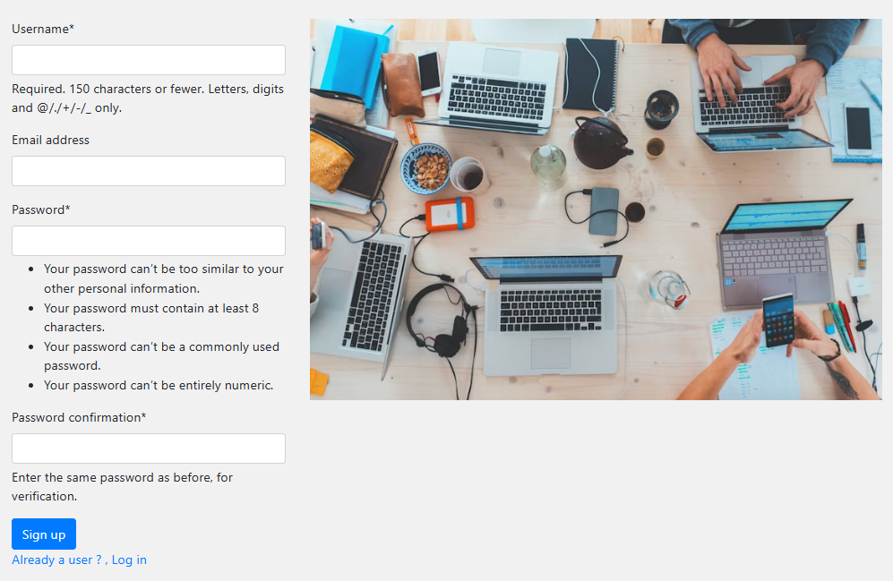
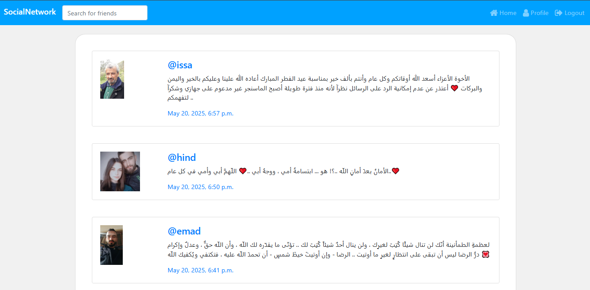
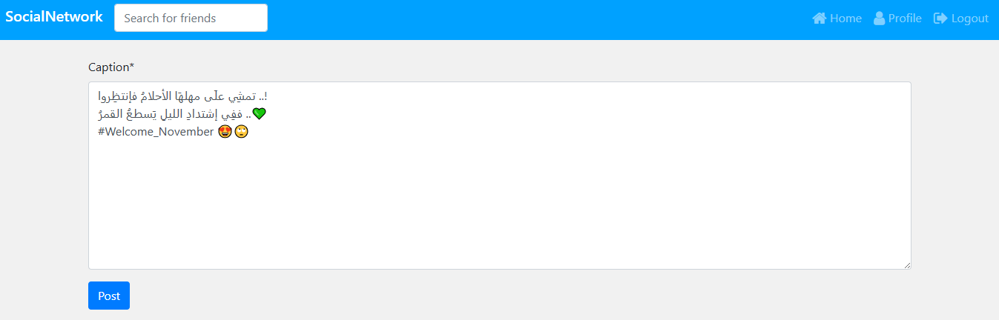
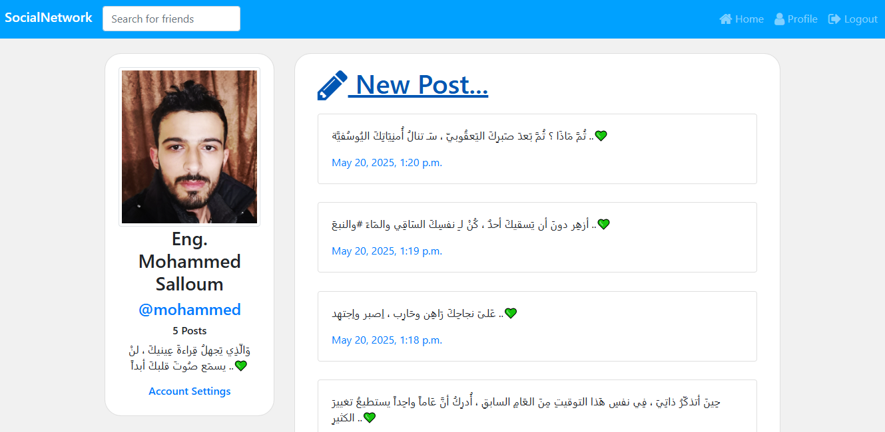
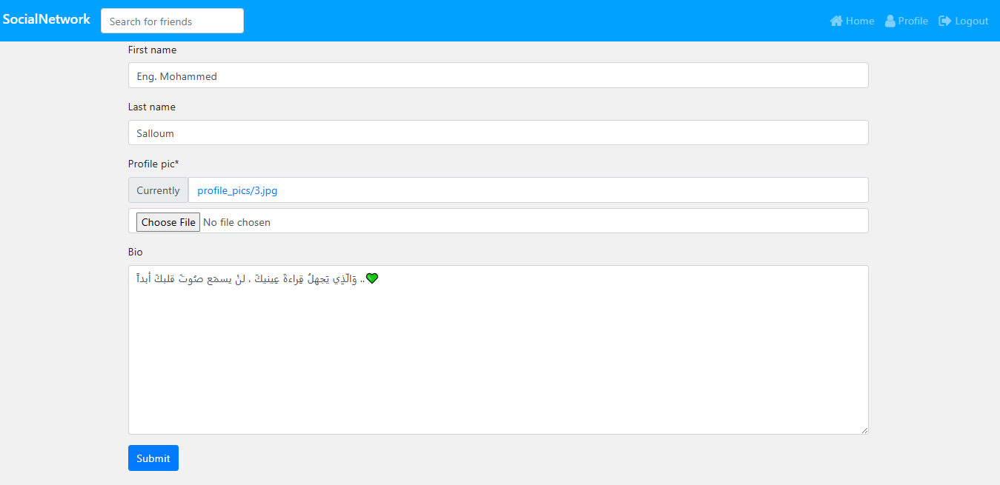

# 🌐 Social Network Application – Full-Stack Web Application

### 🛠️ Personal Project – May 2025

Social Network Application is a full-stack platform built to connect and engage users, developed with Python Django and SQLite. It features user registration, profile management, text post creation, user search, and follow functionality. The app is crafted with simplicity and security in mind, ensuring a smooth user experience across all devices with a responsive Bootstrap 5 frontend.

---

## 🔧 Tech Stack

- **Backend**: Python (Django), SQLite (via Django ORM)
- **Frontend**: HTML5, CSS3, Bootstrap 5

---

## 🌟 Features

- 📝 User Registration and Authentication  
- 👤 Profile Management  
- 💬 Text-Only Posts  
- 🔍 User Search and Follow System  
- 🔐 Secure and Clean Architecture  
- 📱 Responsive Design

---

## 📸 Screenshots

### 🖥️ Web Application Interfaces

#### 🆕 Signup Page  

#### 🔐 Login Page  

#### 🏠 Home Feed  

#### ✏️ Create Post  

#### 👤 User Profile  

#### ⚙️ Edit Profile  

---

## 📂 Repository

🔗 [SocialNetworkApp — GitHub Repository](https://github.com/mohammed-salloum/SocialNetworkApp)

---

## 📌 Notes

This project was created as a personal initiative to practice full-stack web development using Django and Bootstrap. It reflects essential social network features in a secure and user-friendly environment.

---

## 📝 Future Improvements

🖼️ Support for image uploads in posts

📬 Notification system

📄 Pagination and infinite scroll

🌍 Multi-language support

📈 Admin dashboard for content moderation

---

## 👨‍💻 Author

**Mohammed Salloum**  
Full-Stack Developer | Django & Front-End Specialist

📧 mohammed.e.salloum@gmail.com 
🔗 [LinkedIn – mohammed-salloum-dev](https://linkedin.com/in/mohammed-salloum-dev)
